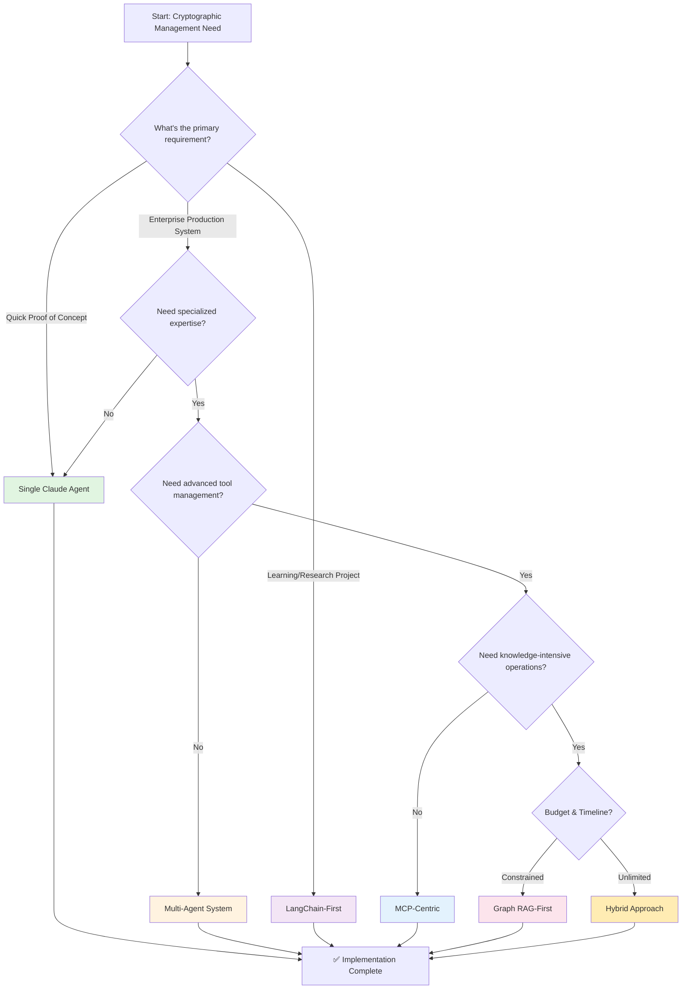
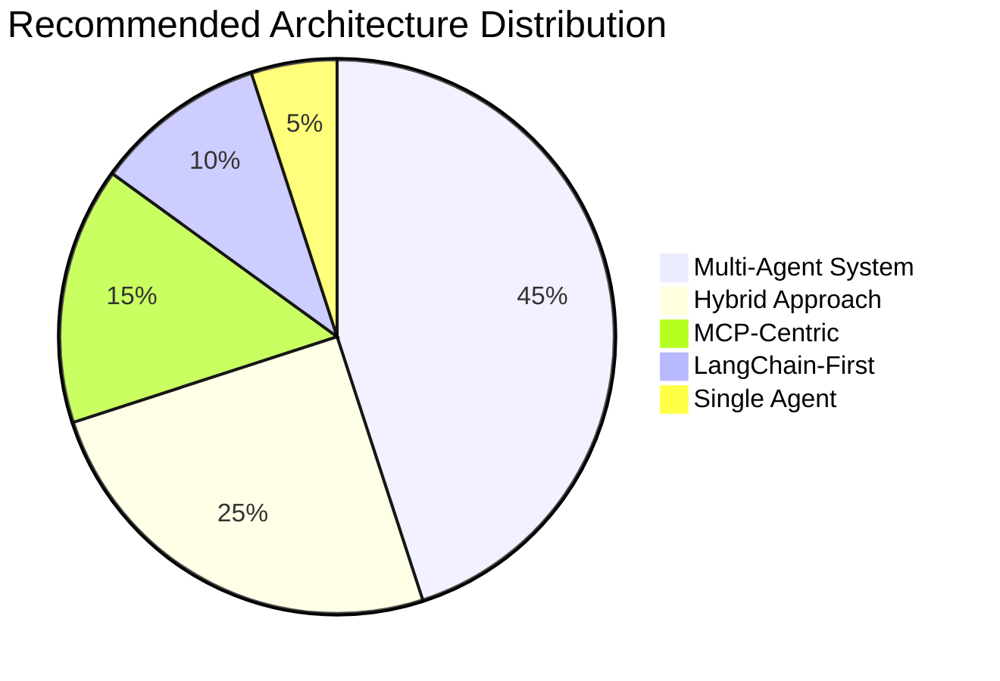

# Flowchart: Architecture Selection Guide

# Rank Architecture Rationale Score
🥇 1st	Multi-Agent System	Best demonstrates understanding of AI orchestration, covers all requirements comprehensively	9.2/10

🥈 2nd	Hybrid Approach	Most complete solution but over-engineered for assignment scope	8.8/10

🥉 3rd	MCP-Centric	Excellent tool safety demonstration, aligns well with Claude's capabilities	7.5/10

4th	LangChain-First	Good balance, shows framework knowledge	6.8/10

5th	Single Claude Agent	Simplest but misses multi-agent orchestration points	5.0/10

6th	Graph RAG-First	Overemphasizes knowledge over operations	4.5/10

# Final Verdict

# Why Multi-Agent Wins:

✅ Best demonstrates AI orchestration - Core requirement of the assignment

✅ Shows understanding of specialization - Different agents for different tasks

✅ Excellent for compliance - Clear separation of duties

✅ Scalable design - Shows forward-thinking architecture

✅ Real-world applicability - Mirrors enterprise security patterns
