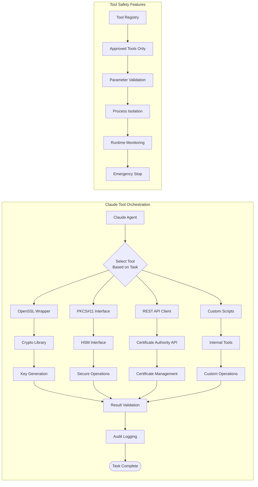
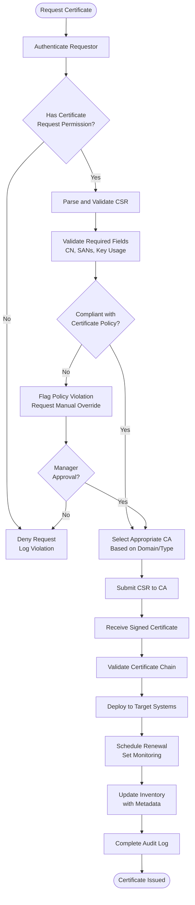

# 2.1 Policy Configuration Example

```
# policies/crypto-policy.yaml
version: "1.0"
last_updated: "2024-01-15"
policy_owner: "Security Team"

key_generation:
  rsa:
    min_key_size: 2048
    preferred_key_size: 3072
    max_key_size: 4096
  ecc:
    allowed_curves:
      - P-256
      - P-384
      - P-521
    min_strength: 128  # bits

certificate_policies:
  validity_periods:
    root_ca: 3650      # days
    intermediate_ca: 1825
    server_tls: 398
    client_auth: 365
    
  extended_key_usages:
    server_auth:
      - serverAuth
    client_auth:
      - clientAuth
    code_signing:
      - codeSigning

compliance:
  standards:
    - nist_800-57
    - pci_dss_v4
    - hipaa
  auto_renewal_threshold: 30  # days before expiry
  mandatory_revocation_cases:
    - private_key_compromise
    - ca_compromise
    - affiliation_changed
```

# 2.2 Database Schema

```
-- Database schema for crypto inventory
CREATE TABLE cryptographic_keys (
    key_id UUID PRIMARY KEY,
    key_type VARCHAR(20) NOT NULL, -- 'RSA', 'ECC'
    key_size INTEGER,
    curve_name VARCHAR(50),
    public_key TEXT NOT NULL,
    private_key_ref VARCHAR(255), -- Reference to secure storage
    key_state VARCHAR(20) DEFAULT 'ACTIVE', -- ACTIVE, COMPROMISED, DESTROYED
    created_at TIMESTAMP DEFAULT CURRENT_TIMESTAMP,
    created_by VARCHAR(100),
    expires_at TIMESTAMP,
    metadata JSONB
);

CREATE TABLE certificates (
    cert_id UUID PRIMARY KEY,
    key_id UUID REFERENCES cryptographic_keys(key_id),
    common_name VARCHAR(255) NOT NULL,
    san_list TEXT[], -- Subject Alternative Names
    issuer_cn VARCHAR(255),
    serial_number VARCHAR(100) UNIQUE,
    valid_from TIMESTAMP NOT NULL,
    valid_to TIMESTAMP NOT NULL,
    cert_state VARCHAR(20) DEFAULT 'VALID', -- VALID, EXPIRED, REVOKED
    revocation_reason VARCHAR(100),
    revocation_date TIMESTAMP,
    cert_chain TEXT[], -- Full chain
    cert_pem TEXT NOT NULL,
    created_at TIMESTAMP DEFAULT CURRENT_TIMESTAMP,
    last_renewed TIMESTAMP,
    metadata JSONB
);

CREATE TABLE audit_logs (
    log_id BIGSERIAL PRIMARY KEY,
    timestamp TIMESTAMP DEFAULT CURRENT_TIMESTAMP,
    actor VARCHAR(100) NOT NULL,
    action VARCHAR(50) NOT NULL,
    resource_type VARCHAR(50),
    resource_id UUID,
    parameters JSONB,
    result VARCHAR(20), -- SUCCESS, FAILURE
    error_message TEXT,
    policy_version VARCHAR(20),
    signature TEXT -- Digital signature of log entry
);
```



# 2.3 Tool Interface Layer

```
# tools/crypto_tools.py
import subprocess
import json
import logging
from typing import Dict, Any, Optional
from abc import ABC, abstractmethod

class CryptoTool(ABC):
    """Base class for all cryptographic tools"""
    
    @abstractmethod
    def execute(self, command: Dict[str, Any]) -> Dict[str, Any]:
        pass
    
    @abstractmethod
    def validate_output(self, output: Any) -> bool:
        pass

class OpenSSLTool(CryptoTool):
    """Wrapper for OpenSSL CLI with safety checks"""
    
    def __init__(self, config: Dict[str, Any]):
        self.allowed_commands = config.get('allowed_commands', [])
        self.timeout = config.get('timeout', 30)
        
    def execute(self, command: Dict[str, Any]) -> Dict[str, Any]:
        # Validate command is allowed
        if command['action'] not in self.allowed_commands:
            raise ValueError(f"Command {command['action']} not permitted")
        
        # Sanitize inputs
        sanitized_cmd = self._sanitize_command(command)
        
        # Execute with timeout
        try:
            result = subprocess.run(
                sanitized_cmd,
                capture_output=True,
                text=True,
                timeout=self.timeout
            )
            
            return {
                'success': result.returncode == 0,
                'stdout': result.stdout,
                'stderr': result.stderr,
                'returncode': result.returncode
            }
        except subprocess.TimeoutExpired:
            return {'success': False, 'error': 'Command timeout'}
    
    def _sanitize_command(self, command: Dict[str, Any]) -> list:
        """Convert command dict to safe CLI arguments"""
        # Prevent injection attacks
        sanitized = []
        for arg in command['args']:
            if isinstance(arg, str):
                # Remove dangerous characters
                arg = arg.replace(';', '').replace('|', '').replace('&', '')
                arg = arg.replace('$', '').replace('`', '')
            sanitized.append(str(arg))
        return sanitized

class VaultTool(CryptoTool):
    """Integration with HashiCorp Vault"""
    
    def __init__(self, vault_addr: str, token: str):
        self.vault_addr = vault_addr
        self.token = token
        
    def execute(self, command: Dict[str, Any]) -> Dict[str, Any]:
        import hvac
        
        client = hvac.Client(url=self.vault_addr, token=self.token)
        
        action = command['action']
        
        try:
            if action == 'generate_key':
                # Generate key in Vault
                response = client.secrets.transit.generate_data_key(
                    name=command['key_name'],
                    key_type=command.get('key_type', 'rsa-2048')
                )
                return {'success': True, 'data': response['data']}
                
            elif action == 'sign_csr':
                # Sign CSR using Vault PKI
                response = client.secrets.pki.sign_intermediate(
                    csr=command['csr_pem'],
                    common_name=command['common_name']
                )
                return {'success': True, 'data': response['data']}
                
        except Exception as e:
            return {'success': False, 'error': str(e)}
```

# 2.4 Claude Agent Implementation

```
# agent/claude_agent.py
import anthropic
import yaml
import json
from datetime import datetime, timedelta
from typing import Dict, Any, List
from tools.crypto_tools import OpenSSLTool, VaultTool
from database.inventory_db import CryptoInventoryDB

class ClaudeCryptoAgent:
    """Main agent class orchestrating cryptographic operations"""
    
    def __init__(self, api_key: str, config_path: str):
        self.client = anthropic.Anthropic(api_key=api_key)
        self.policies = self._load_policies(config_path)
        self.tools = self._initialize_tools()
        self.db = CryptoInventoryDB()
        self.audit_logger = AuditLogger()
        
    def _load_policies(self, config_path: str) -> Dict[str, Any]:
        """Load cryptographic policies from YAML"""
        with open(config_path, 'r') as f:
            return yaml.safe_load(f)
    
    def _initialize_tools(self) -> Dict[str, Any]:
        """Initialize all available tools"""
        return {
            'openssl': OpenSSLTool(self.policies['tools']['openssl']),
            'vault': VaultTool(
                self.policies['tools']['vault']['addr'],
                self.policies['tools']['vault']['token']
            )
        }
    
    def process_request(self, user_request: str, user_context: Dict[str, Any]) -> Dict[str, Any]:
        """Main entry point for processing cryptographic requests"""
        
        # Log the request
        self.audit_logger.log_request(user_context['actor'], user_request)
        
        # Step 1: Claude plans the operation
        plan = self._plan_operation(user_request, user_context)
        
        # Step 2: Validate against policies
        validation_result = self._validate_plan(plan)
        if not validation_result['valid']:
            return self._create_error_response(validation_result['errors'])
        
        # Step 3: Execute the plan
        execution_result = self._execute_plan(plan)
        
        # Step 4: Log and return results
        self.audit_logger.log_completion(
            user_context['actor'],
            plan['operation'],
            execution_result
        )
        
        return execution_result
    
    def _plan_operation(self, request: str, context: Dict[str, Any]) -> Dict[str, Any]:
        """Use Claude to plan the cryptographic operation"""
        
        system_prompt = self._build_system_prompt(context)
        
        response = self.client.messages.create(
            model="claude-3-opus-20240229",
            max_tokens=1000,
            system=system_prompt,
            messages=[
                {
                    "role": "user",
                    "content": f"Plan the cryptographic operation for: {request}"
                }
            ]
        )
        
        # Parse Claude's response into a structured plan
        plan = self._parse_claude_response(response.content[0].text)
        return plan
    
    def _build_system_prompt(self, context: Dict[str, Any]) -> str:
        """Build system prompt with policies and constraints"""
        
        prompt = f"""
        You are a Cryptographic Operations Agent. Your role is to plan and execute 
        cryptographic operations safely and in compliance with policies.
        
        CRITICAL CONSTRAINTS:
        1. NEVER invent new cryptographic algorithms
        2. ONLY use approved parameters from the policy
        3. ALWAYS validate outputs before proceeding
        4. LOG every action for audit purposes
        
        CURRENT POLICIES:
        {json.dumps(self.policies, indent=2)}
        
        USER CONTEXT:
        Role: {context.get('role', 'unknown')}
        Permissions: {context.get('permissions', [])}
        
        RESPONSE FORMAT:
        You must respond with a JSON object containing:
        {{
            "operation": "string",
            "steps": [
                {{
                    "step_number": 1,
                    "action": "string",
                    "tool": "string",
                    "parameters": {{}},
                    "validation": "string"
                }}
            ],
            "expected_outputs": [],
            "safety_checks": []
        }}
        """
        
        return prompt
    
    def _validate_plan(self, plan: Dict[str, Any]) -> Dict[str, Any]:
        """Validate the plan against cryptographic policies"""
        
        errors = []
        
        # Check key sizes if key generation is involved
        if plan['operation'] in ['generate_key_pair', 'create_certificate']:
            key_params = plan.get('parameters', {}).get('key', {})
            if key_params.get('type') == 'RSA':
                if key_params.get('size', 0) < self.policies['key_generation']['rsa']['min_key_size']:
                    errors.append(f"RSA key size {key_params.get('size')} below minimum")
        
        # Check validity periods for certificates
        if 'validity_days' in plan.get('parameters', {}):
            max_days = self.policies['certificate_policies']['validity_periods'].get(
                plan['parameters'].get('cert_type', 'server_tls'),
                365
            )
            if plan['parameters']['validity_days'] > max_days:
                errors.append(f"Validity period exceeds maximum of {max_days} days")
        
        return {
            'valid': len(errors) == 0,
            'errors': errors
        }
    
    def _execute_plan(self, plan: Dict[str, Any]) -> Dict[str, Any]:
        """Execute the validated plan step by step"""
        
        results = []
        
        for step in plan['steps']:
            # Execute step
            tool = self.tools.get(step['tool'])
            if not tool:
                results.append({
                    'step': step['step_number'],
                    'success': False,
                    'error': f"Tool {step['tool']} not available"
                })
                continue
            
            # Execute with tool
            step_result = tool.execute(step['parameters'])
            
            # Validate output
            if step_result['success']:
                validation_passed = tool.validate_output(step_result.get('output'))
                if not validation_passed:
                    step_result['success'] = False
                    step_result['error'] = 'Output validation failed'
            
            results.append({
                'step': step['step_number'],
                'success': step_result['success'],
                'result': step_result
            })
            
            # Stop if any step fails
            if not step_result['success']:
                break
        
        # Determine overall success
        all_success = all(r['success'] for r in results)
        
        # Update inventory if successful
        if all_success and plan['operation'] in ['generate_key_pair', 'create_certificate']:
            self._update_inventory(plan, results)
        
        return {
            'operation': plan['operation'],
            'overall_success': all_success,
            'step_results': results,
            'timestamp': datetime.utcnow().isoformat()
        }
    
    def _update_inventory(self, plan: Dict[str, Any], results: List[Dict[str, Any]]):
        """Update cryptographic inventory database"""
        
        # Extract key material from results
        key_data = None
        cert_data = None
        
        for result in results:
            if 'key' in result.get('result', {}):
                key_data = result['result']['key']
            if 'certificate' in result.get('result', {}):
                cert_data = result['result']['certificate']
        
        # Store in database
        if key_data:
            self.db.store_key(key_data)
        if cert_data:
            self.db.store_certificate(cert_data)

class AuditLogger:
    """Immutable audit logging system"""
    
    def __init__(self, log_store: str = "audit_logs"):
        self.log_store = log_store
        
    def log_request(self, actor: str, request: str):
        """Log initial request"""
        entry = {
            'timestamp': datetime.utcnow().isoformat(),
            'actor': actor,
            'action': 'REQUEST',
            'request': request,
            'session_id': self._generate_session_id()
        }
        
        self._write_log_entry(entry)
    
    def log_completion(self, actor: str, operation: str, result: Dict[str, Any]):
        """Log operation completion"""
        entry = {
            'timestamp': datetime.utcnow().isoformat(),
            'actor': actor,
            'action': 'COMPLETION',
            'operation': operation,
            'result': result,
            'signature': self._sign_entry(entry)  # Digital signature
        }
        
        self._write_log_entry(entry)
    
    def _write_log_entry(self, entry: Dict[str, Any]):
        """Write to immutable log store"""
        # Implementation for WORM storage or blockchain
        pass
    
    def _generate_session_id(self) -> str:
        """Generate unique session ID"""
        import uuid
        return str(uuid.uuid4())
    
    def _sign_entry(self, entry: Dict[str, Any]) -> str:
        """Digitally sign log entry"""
        # Implementation for digital signatures
        return "signature_placeholder"
```

# 2.5 Example Workflow: Certificate Issuance




```
# workflows/certificate_issuance.py
class CertificateIssuanceWorkflow:
    """Complete workflow for certificate issuance"""
    
    def __init__(self, agent: ClaudeCryptoAgent):
        self.agent = agent
    
    def issue_certificate(self, domain: str, validity_days: int, 
                         san_list: List[str], user_context: Dict[str, Any]) -> Dict[str, Any]:
        """
        Complete certificate issuance workflow:
        1. Generate key pair
        2. Create CSR
        3. Submit to CA
        4. Retrieve and validate certificate
        5. Store in inventory
        """
        
        # Build request for Claude
        request = f"""
        Issue a TLS certificate for domain: {domain}
        Validity: {validity_days} days
        SANs: {', '.join(san_list)}
        Certificate type: server_auth
        """
        
        # Process through agent
        result = self.agent.process_request(request, user_context)
        
        return result

# Example usage
if __name__ == "__main__":
    # Initialize agent
    agent = ClaudeCryptoAgent(
        api_key="your-claude-api-key",
        config_path="config/policies.yaml"
    )
    
    # Create workflow
    workflow = CertificateIssuanceWorkflow(agent)
    
    # User context (from authentication system)
    user_context = {
        'actor': 'admin@example.com',
        'role': 'security_admin',
        'permissions': ['issue_certificates', 'generate_keys']
    }
    
    # Issue certificate
    result = workflow.issue_certificate(
        domain="api.example.com",
        validity_days=365,
        san_list=["*.api.example.com", "api.example.com"],
        user_context=user_context
    )
    
    print(json.dumps(result, indent=2))
```

# 2.6 Security Safeguards

```
# security/safeguards.py
class CryptographicSafeguards:
    """Security safeguards for cryptographic operations"""
    
    @staticmethod
    def prevent_weak_keys(key_params: Dict[str, Any]) -> bool:
        """Prevent generation of weak keys"""
        if key_params.get('type') == 'RSA':
            return key_params.get('size', 0) >= 2048
        elif key_params.get('type') == 'ECC':
            allowed_curves = ['P-256', 'P-384', 'P-521']
            return key_params.get('curve') in allowed_curves
        return False
    
    @staticmethod
    def validate_certificate_parameters(cert_params: Dict[str, Any]) -> List[str]:
        """Validate certificate parameters"""
        errors = []
        
        # Check validity period
        if cert_params.get('validity_days', 0) > 825:  # Approximately 2 years
            errors.append("Validity period exceeds maximum allowed")
        
        # Check SANs
        sans = cert_params.get('san_list', [])
        if len(sans) > 100:  # Reasonable limit
            errors.append("Too many Subject Alternative Names")
        
        # Check key usage
        if 'serverAuth' not in cert_params.get('ekus', []):
            errors.append("Server certificate must include serverAuth EKU")
        
        return errors
    
    @staticmethod
    def enforce_policy_compliance(operation: str, parameters: Dict[str, Any], 
                                 policy: Dict[str, Any]) -> bool:
        """Enforce policy compliance for operations"""
        
        # Implementation of various compliance checks
        checks = [
            CryptographicSafeguards.check_key_size_compliance,
            CryptographicSafeguards.check_validity_period_compliance,
            CryptographicSafeguards.check_algorithm_compliance
        ]
        
        for check in checks:
            if not check(parameters, policy):
                return False
        
        return True
```
