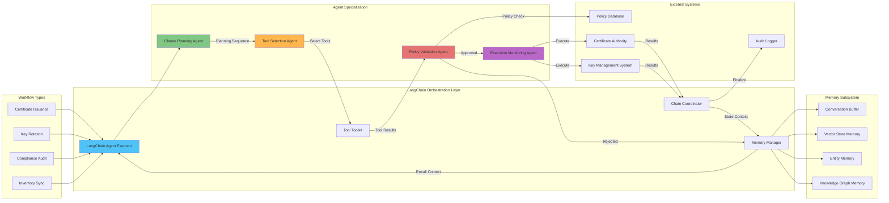

# 3. LangChain Integration
# 3.1 LangChain Agent Framework



```
# agents/langchain_agents.py
from langchain.agents import AgentExecutor, create_react_agent
from langchain.tools import Tool
from langchain.prompts import PromptTemplate
from langchain.memory import ConversationBufferMemory
from langchain.chains import LLMChain
from langchain_community.llms import Anthropic
import asyncio

class LangChainCryptoAgent:
    """Cryptographic agent using LangChain framework"""
    
    def __init__(self, agent_type: str, llm_api_key: str):
        self.llm = Anthropic(api_key=llm_api_key)
        self.memory = ConversationBufferMemory(memory_key="chat_history")
        self.tools = self._initialize_tools()
        self.agent = self._create_agent(agent_type)
        
    def _initialize_tools(self):
        """Initialize MCP tools via LangChain"""
        
        # MCP Tools wrapped for LangChain
        mcp_tools = [
            Tool(
                name="mcp_generate_key",
                func=self._call_mcp_tool,
                description="Generate cryptographic key pair via MCP",
                args_schema=KeyGenerationSchema
            ),
            Tool(
                name="mcp_create_certificate",
                func=self._call_mcp_tool,
                description="Create X.509 certificate via MCP",
                args_schema=CertificateCreationSchema
            ),
            Tool(
                name="mcp_validate_policy",
                func=self._call_mcp_tool,
                description="Validate operation against policies via MCP",
                args_schema=PolicyValidationSchema
            )
        ]
        
        # Graph RAG Tools
        graph_tools = [
            Tool(
                name="query_cve_database",
                func=self._query_cve_db,
                description="Query CVE database for vulnerabilities",
                args_schema=CVESearchSchema
            ),
            Tool(
                name="search_crypto_standards",
                func=self._search_standards,
                description="Search cryptographic standards and RFCs",
                args_schema=StandardsSearchSchema
            )
        ]
        
        return mcp_tools + graph_tools
    
    def _create_agent(self, agent_type: str):
        """Create specialized agent based on type"""
        
        if agent_type == "key_generation":
            prompt = PromptTemplate.from_template("""
            You are a Key Generation Specialist Agent. Your responsibilities:
            1. Generate cryptographic keys following NIST standards
            2. Validate key strength against policies
            3. Ensure secure key storage
            4. Log all key generation activities
            
            Available tools: {tools}
            
            History: {chat_history}
            
            User request: {input}
            
            {agent_scratchpad}
            """)
            
        elif agent_type == "compliance":
            prompt = PromptTemplate.from_template("""
            You are a Compliance Officer Agent. Your responsibilities:
            1. Validate all operations against policies
            2. Check regulatory compliance (NIST, FIPS, PCI-DSS)
            3. Generate compliance reports
            4. Monitor for policy violations
            
            Available tools: {tools}
            
            History: {chat_history}
            
            User request: {input}
            
            {agent_scratchpad}
            """)
        
        return create_react_agent(
            llm=self.llm,
            tools=self.tools,
            prompt=prompt
        )
    
    async def execute(self, task: str):
        """Execute task using LangChain agent"""
        agent_executor = AgentExecutor.from_agent_and_tools(
            agent=self.agent,
            tools=self.tools,
            memory=self.memory,
            verbose=True,
            handle_parsing_errors=True
        )
        
        return await agent_executor.ainvoke({"input": task})
```

# 3.2 Multi-Agent Collaboration with LangGraph

```
# agents/langgraph_orchestrator.py
from langgraph.graph import StateGraph, END
from typing import TypedDict, List, Annotated
import operator

class AgentState(TypedDict):
    """State for multi-agent workflow"""
    task: str
    current_step: str
    results: dict
    errors: List[str]
    agent_history: List[str]

class MultiAgentWorkflow:
    """Orchestrate multiple agents using LangGraph"""
    
    def __init__(self):
        self.workflow = StateGraph(AgentState)
        self._build_workflow()
        
    def _build_workflow(self):
        """Build multi-agent workflow graph"""
        
        # Define nodes (agents)
        self.workflow.add_node("supervisor", self.supervisor_agent)
        self.workflow.add_node("key_generator", self.key_generation_agent)
        self.workflow.add_node("cert_manager", self.certificate_agent)
        self.workflow.add_node("compliance_checker", self.compliance_agent)
        self.workflow.add_node("auditor", self.audit_agent)
        
        # Define edges (workflow paths)
        self.workflow.add_edge("supervisor", "key_generator")
        self.workflow.add_conditional_edges(
            "key_generator",
            self._check_key_generation,
            {
                "success": "cert_manager",
                "failure": "supervisor"  # Return to supervisor for error handling
            }
        )
        self.workflow.add_edge("cert_manager", "compliance_checker")
        self.workflow.add_conditional_edges(
            "compliance_checker",
            self._check_compliance,
            {
                "compliant": "auditor",
                "non_compliant": "supervisor"
            }
        )
        self.workflow.add_edge("auditor", END)
        
        # Set entry point
        self.workflow.set_entry_point("supervisor")
        
        # Compile graph
        self.app = self.workflow.compile()
    
    async def supervisor_agent(self, state: AgentState):
        """Supervisor agent coordinates the workflow"""
        # Analyze task and delegate
        task = state["task"]
        
        if "generate certificate" in task.lower():
            return {
                "current_step": "key_generation",
                "agent_history": state.get("agent_history", []) + ["Supervisor delegated to key generator"]
            }
        elif "rotate key" in task.lower():
            return {
                "current_step": "key_rotation",
                "agent_history": state.get("agent_history", []) + ["Supervisor initiated key rotation"]
            }
    
    async def key_generation_agent(self, state: AgentState):
        """Specialized key generation agent"""
        # Use MCP tools via LangChain
        agent = LangChainCryptoAgent("key_generation", "api_key")
        result = await agent.execute(f"Generate key for: {state['task']}")
        
        return {
            "results": {**state.get("results", {}), "key_generation": result},
            "agent_history": state.get("agent_history", []) + ["Key generated successfully"]
        }
    
    def _check_key_generation(self, state: AgentState):
        """Check if key generation was successful"""
        if "error" in state.get("results", {}).get("key_generation", {}):
            return "failure"
        return "success"
```

