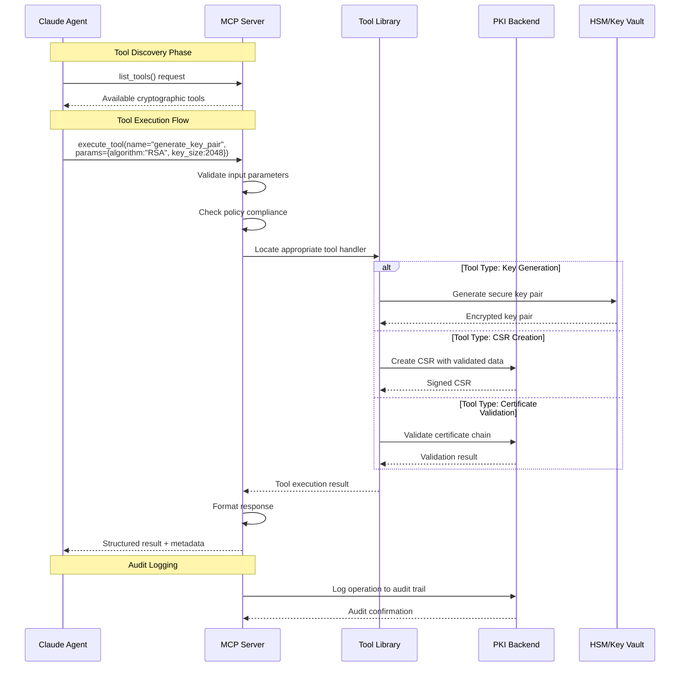

# 2. Model Context Protocol (MCP) Integration
# 2.1 What is MCP?

Model Context Protocol (MCP) is an open protocol developed by Anthropic that standardizes how AI models interact with external tools, data sources, and systems. It provides:

Standardized Tool Discovery: Agents can discover available tools dynamically

Unified Interface: Consistent way to call tools regardless of implementation

Enhanced Safety: Built-in validation and permission controls

Extensibility: Easy to add new tools without agent modification



# 2.2 MCP Server Implementation

```
# mcp/crypto_mcp_server.py
from mcp import Server, types
import asyncio
from typing import Dict, Any, List
import json

class CryptoToolsMCPServer:
    """MCP server exposing cryptographic tools"""
    
    def __init__(self):
        self.server = Server("crypto-tools-mcp")
        self._register_resources()
        self._register_tools()
        
    def _register_resources(self):
        """Register resources (policies, templates, etc.)"""
        
        @self.server.list_resources()
        async def list_resources() -> List[types.Resource]:
            return [
                types.Resource(
                    uri="policy://crypto/standard-policy",
                    name="Standard Cryptographic Policy",
                    description="Organization's standard cryptographic policy",
                    mime_type="application/json"
                ),
                types.Resource(
                    uri="template://csr/default",
                    name="Default CSR Template",
                    description="Standard CSR template with placeholders",
                    mime_type="text/yaml"
                )
            ]
        
        @self.server.read_resource()
        async def read_resource(uri: str) -> str:
            if uri == "policy://crypto/standard-policy":
                return json.dumps(self._load_policy())
            elif uri == "template://csr/default":
                return self._load_csr_template()
            raise ValueError(f"Unknown resource: {uri}")
    
    def _register_tools(self):
        """Register cryptographic tools"""
        
        @self.server.list_tools()
        async def list_tools() -> List[types.Tool]:
            return [
                types.Tool(
                    name="generate_key_pair",
                    description="Generate RSA or ECC key pair with policy validation",
                    inputSchema={
                        "type": "object",
                        "properties": {
                            "algorithm": {
                                "type": "string",
                                "enum": ["RSA", "ECC"],
                                "description": "Cryptographic algorithm"
                            },
                            "key_size": {
                                "type": "integer",
                                "description": "Key size in bits"
                            },
                            "curve": {
                                "type": "string",
                                "enum": ["P-256", "P-384", "P-521"],
                                "description": "ECC curve name"
                            }
                        },
                        "required": ["algorithm"]
                    }
                ),
                types.Tool(
                    name="create_csr",
                    description="Create Certificate Signing Request",
                    inputSchema={
                        "type": "object",
                        "properties": {
                            "common_name": {"type": "string"},
                            "organization": {"type": "string"},
                            "san_list": {
                                "type": "array",
                                "items": {"type": "string"}
                            },
                            "key_id": {"type": "string"}
                        },
                        "required": ["common_name", "key_id"]
                    }
                ),
                types.Tool(
                    name="validate_certificate",
                    description="Validate certificate against policies",
                    inputSchema={
                        "type": "object",
                        "properties": {
                            "certificate_pem": {"type": "string"},
                            "validation_type": {
                                "type": "string",
                                "enum": ["policy", "chain", "ocsp", "crl"]
                            }
                        },
                        "required": ["certificate_pem"]
                    }
                )
            ]
        
        @self.server.call_tool()
        async def call_tool(name: str, arguments: Dict[str, Any]) -> types.CallToolResult:
            if name == "generate_key_pair":
                result = await self._generate_key_pair(**arguments)
                return types.CallToolResult(
                    content=[types.TextContent(type="text", text=json.dumps(result))]
                )
            elif name == "create_csr":
                result = await self._create_csr(**arguments)
                return types.CallToolResult(
                    content=[types.TextContent(type="text", text=json.dumps(result))]
                )
            raise ValueError(f"Unknown tool: {name}")
    
    async def _generate_key_pair(self, algorithm: str, **kwargs):
        """Generate key pair with MCP validation"""
        # Validate against policy via MCP resource
        policy = json.loads(await self.read_resource("policy://crypto/standard-policy"))
        
        if algorithm == "RSA":
            key_size = kwargs.get("key_size", 2048)
            if key_size < policy["key_generation"]["rsa"]["min_key_size"]:
                raise ValueError(f"Key size {key_size} below minimum")
            
            # Generate using OpenSSL via MCP
            return await self._call_external_tool("openssl", "genrsa", str(key_size))
            
        elif algorithm == "ECC":
            curve = kwargs.get("curve", "P-256")
            if curve not in policy["key_generation"]["ecc"]["allowed_curves"]:
                raise ValueError(f"Curve {curve} not allowed")
            
            return await self._call_external_tool("openssl", "ecparam", curve)
    
    async def start(self):
        """Start MCP server"""
        await self.server.start()
```

# 2.3 Advantages of MCP
Standardization: All tools follow same protocol

Discoverability: Agents can discover new tools at runtime

Safety: Built-in validation and permission system

Interoperability: Works across different AI models

Extensibility: Add tools without modifying agents

Debugging: Clear tool calls and responses

Versioning: Tool version management.

