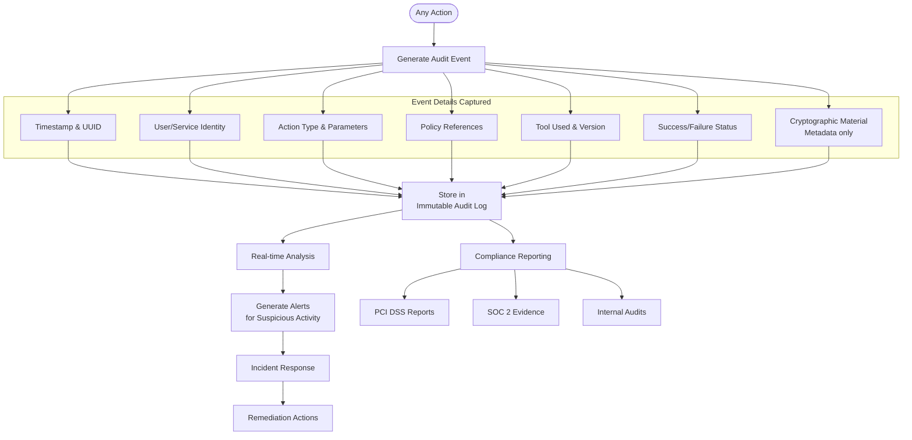

# 4.1 Audit Reports

```
# reporting/audit_reports.py
class ComplianceReports:
    """Generate compliance and audit reports"""
    
    @staticmethod
    def generate_expiry_report(db_connection) -> Dict[str, Any]:
        """Report on expiring certificates"""
        query = """
        SELECT common_name, valid_to, 
               (valid_to - CURRENT_DATE) as days_remaining
        FROM certificates
        WHERE cert_state = 'VALID'
        AND valid_to BETWEEN CURRENT_DATE AND CURRENT_DATE + INTERVAL '30 days'
        ORDER BY valid_to ASC;
        """
        
        # Execute query and format report
        return {
            'report_type': 'certificate_expiry',
            'generated_at': datetime.utcnow().isoformat(),
            'expiring_certificates': []  # Query results
        }
    
    @staticmethod
    def generate_policy_compliance_report(policy: Dict[str, Any], 
                                         inventory: List[Dict[str, Any]]) -> Dict[str, Any]:
        """Check inventory against policies"""
        violations = []
        
        for item in inventory:
            # Check key sizes
            if item['key_type'] == 'RSA' and item['key_size'] < policy['min_key_size']:
                violations.append({
                    'asset_id': item['id'],
                    'violation': 'weak_key_size',
                    'details': f"RSA key size {item['key_size']} < {policy['min_key_size']}"
                })
            
            # Check certificate validity
            if 'valid_to' in item:
                days_valid = (item['valid_to'] - datetime.utcnow()).days
                if days_valid > policy['max_validity_days']:
                    violations.append({
                        'asset_id': item['id'],
                        'violation': 'excessive_validity',
                        'details': f"Validity {days_valid} days > {policy['max_validity_days']}"
                    })
        
        return {
            'total_assets': len(inventory),
            'violations_found': len(violations),
            'compliance_percentage': ((len(inventory) - len(violations)) / len(inventory)) * 100,
            'violations': violations
        }
```

# 4.2 Alerting System

```
# monitoring/alerts.py
class CryptographicAlerts:
    """Alerting system for cryptographic events"""
    
    def __init__(self):
        self.alert_channels = []
        
    def add_channel(self, channel_type: str, config: Dict[str, Any]):
        """Add alert channel (email, slack, pagerduty)"""
        self.alert_channels.append({
            'type': channel_type,
            'config': config
        })
    
    def send_alert(self, alert_type: str, severity: str, 
                  message: str, context: Dict[str, Any]):
        """Send alert through all configured channels"""
        
        alert = {
            'timestamp': datetime.utcnow().isoformat(),
            'type': alert_type,
            'severity': severity,
            'message': message,
            'context': context
        }
        
        for channel in self.alert_channels:
            if channel['type'] == 'email':
                self._send_email_alert(alert, channel['config'])
            elif channel['type'] == 'slack':
                self._send_slack_alert(alert, channel['config'])
            elif channel['type'] == 'pagerduty':
                self._send_pagerduty_alert(alert, channel['config'])
    
    def _send_email_alert(self, alert: Dict[str, Any], config: Dict[str, Any]):
        """Send email alert"""
        # Implementation using SMTP
        pass
    
    def _send_slack_alert(self, alert: Dict[str, Any], config: Dict[str, Any]):
        """Send Slack alert"""
        # Implementation using Slack API
        pass
```


