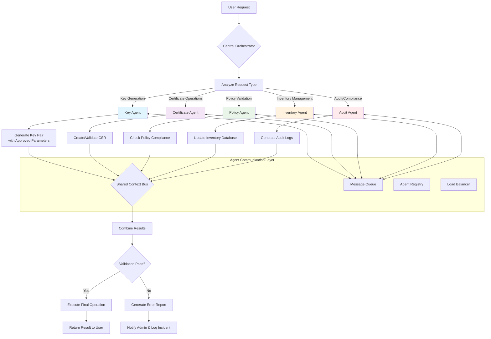

# 1. Multi-Agent Architecture Design
# 1.1 Enhanced System Architecture with Multiple Specialized Agents

```
┌─────────────────────────────────────────────────────────────────────────────┐
│                         Orchestration Layer                                 │
│  ┌─────────────────────────────────────────────────────────────────────┐  │
│  │                    Supervisor Agent (Claude)                        │  │
│  │  • Overall coordination & task delegation                          │  │
│  │  • Conflict resolution & prioritization                            │  │
│  │  • Policy enforcement at highest level                             │  │
│  └──────────────────────┬──────────────────────────────────────────────┘  │
│                         │ Decomposes & Delegates                          │
│          ┌──────────────┼──────────────┬──────────────┬─────────────────┐  │
│          │              │              │              │                 │  │
│  ┌───────▼──────┐┌─────▼──────┐┌──────▼──────┐┌─────▼──────┐┌─────────▼────┐│
│  │Key Generation││Certificate ││Compliance   ││Audit &     ││Inventory    ││
│  │Agent         ││Management  ││Enforcement  ││Reporting   ││Manager      ││
│  │• RSA/ECC key ││Agent       ││Agent        ││Agent       ││Agent        ││
│  │generation    ││• CSR       ││• Policy     ││• Real-time ││• Asset      ││
│  │• Key         ││creation    ││validation   ││monitoring  ││tracking     ││
│  │strength      ││• Certificate││• Standards  ││• Automated ││• Lifecycle  ││
│  │validation    ││issuance    ││compliance   ││reporting   ││management   ││
│  │• HSM         ││• Renewal   ││• Risk       ││• Alerting  ││• Dependency ││
│  │integration   ││& revocation││assessment   ││system      ││mapping      ││
│  └──────────────┘└─────────────┘└─────────────┘└────────────┘└─────────────┘│
└─────────────────────────┬──────────────────────────────────────────────────┘
                          │ Model Context Protocol (MCP)
                          ▼
┌─────────────────────────────────────────────────────────────────────────────┐
│                      Tool & Knowledge Layer                                 │
│  ┌─────────────────────────────────────────────────────────────────────┐  │
│  │                         MCP Server                                  │  │
│  │  • Unified tool discovery & execution                              │  │
│  │  • Standardized interface for all tools                            │  │
│  │  • Tool metadata & capabilities registry                           │  │
│  └──────────────────────┬──────────────────────────────────────────────┘  │
│          ┌──────────────┼──────────────┬──────────────┬─────────────────┐  │
│          │              │              │              │                 │  │
│  ┌───────▼──────┐┌─────▼──────┐┌──────▼──────┐┌─────▼──────┐┌─────────▼────┐│
│  │Cryptographic ││PKI/CA       ││HSM/Vault    ││Policy      ││Graph RAG     ││
│  │Tools MCP     ││Tools MCP    ││Tools MCP    ││Repository  ││Knowledge     ││
│  │• OpenSSL     ││• ACME       ││• PKCS#11    ││MCP         ││Base MCP      ││
│  │• Bouncy      ││• EJBCA      ││• HashiCorp  ││• Git       ││• CVE DB      ││
│  │Castle        ││API          ││Vault        ││integration ││• NIST docs   ││
│  │• libsodium   ││• Step CA    ││• Azure Key  ││• Policy    ││• RFCs        ││
│  │              ││             ││Vault        ││versioning  ││• Best        ││
│  │              ││             ││             ││            ││practices     ││
│  └──────────────┘└─────────────┘└─────────────┘└────────────┘└─────────────┘│
└─────────────────────────┬──────────────────────────────────────────────────┘
                          │ LangChain Integration
                          ▼
┌─────────────────────────────────────────────────────────────────────────────┐
│                      Memory & Reasoning Layer                               │
│  ┌─────────────────────────────────────────────────────────────────────┐  │
│  │                    LangChain Framework                              │  │
│  │  • Agent orchestration                                              │  │
│  │  • Tool calling with memory                                         │  │
│  │  • Chain-of-thought reasoning                                       │  │
│  │  • Vector stores for semantic search                                │  │
│  └──────────────────────┬──────────────────────────────────────────────┘  │
│                         │                                                  │
│          ┌──────────────┼──────────────┬──────────────┬─────────────────┐  │
│          │              │              │              │                 │  │
│  ┌───────▼──────┐┌─────▼──────┐┌──────▼──────┐┌─────▼──────┐┌─────────▼────┐│
│  │Conversation  ││Vector      ││Graph        ││Document    ││Agent Memory ││
│  │Memory        ││Store       ││Database     ││Loaders     ││Manager      ││
│  │• Session     ││• Embeddings││• Neo4j      ││• PDF/Text  ││• Short-term ││
│  │history       ││• FAISS     ││• Knowledge  ││• Web       ││memory       ││
│  │• Context     ││• Pinecone  ││graphs       ││scrapers    ││• Long-term  ││
│  │management    ││• Weaviate  ││• Dependency ││• API       ││memory       ││
│  │              ││           ││graphs       ││crawlers    ││             ││
│  └──────────────┘└─────────────┘└─────────────┘└────────────┘└─────────────┘│
└─────────────────────────────────────────────────────────────────────────────┘

```




# 1.2 Agent Communication Protocol

```
# agents/communication.py
from typing import Dict, Any, List
from dataclasses import dataclass
from enum import Enum
import asyncio

class AgentRole(Enum):
    SUPERVISOR = "supervisor"
    KEY_GENERATOR = "key_generator"
    CERT_MANAGER = "certificate_manager"
    COMPLIANCE_OFFICER = "compliance_officer"
    AUDITOR = "auditor"
    INVENTORY_MANAGER = "inventory_manager"

@dataclass
class AgentMessage:
    sender: AgentRole
    receiver: AgentRole
    message_type: str
    content: Dict[str, Any]
    priority: int = 1
    requires_response: bool = False
    message_id: str = None
    correlation_id: str = None

class MultiAgentOrchestrator:
    """Orchestrates communication between specialized agents"""
    
    def __init__(self):
        self.agents = {}
        self.message_queue = asyncio.Queue()
        self.conversation_history = []
        
    def register_agent(self, agent_role: AgentRole, agent_instance):
        """Register an agent with the orchestrator"""
        self.agents[agent_role] = agent_instance
        
    async def send_message(self, message: AgentMessage):
        """Send message between agents"""
        await self.message_queue.put(message)
        self.conversation_history.append(message)
        
    async def process_messages(self):
        """Continuously process agent messages"""
        while True:
            message = await self.message_queue.get()
            await self._route_message(message)
            
    async def _route_message(self, message: AgentMessage):
        """Route message to appropriate agent"""
        receiver = self.agents.get(message.receiver)
        if receiver:
            response = await receiver.receive_message(message)
            if message.requires_response:
                response_msg = AgentMessage(
                    sender=message.receiver,
                    receiver=message.sender,
                    message_type="response",
                    content=response,
                    correlation_id=message.message_id
                )
                await self.send_message(response_msg)
```


