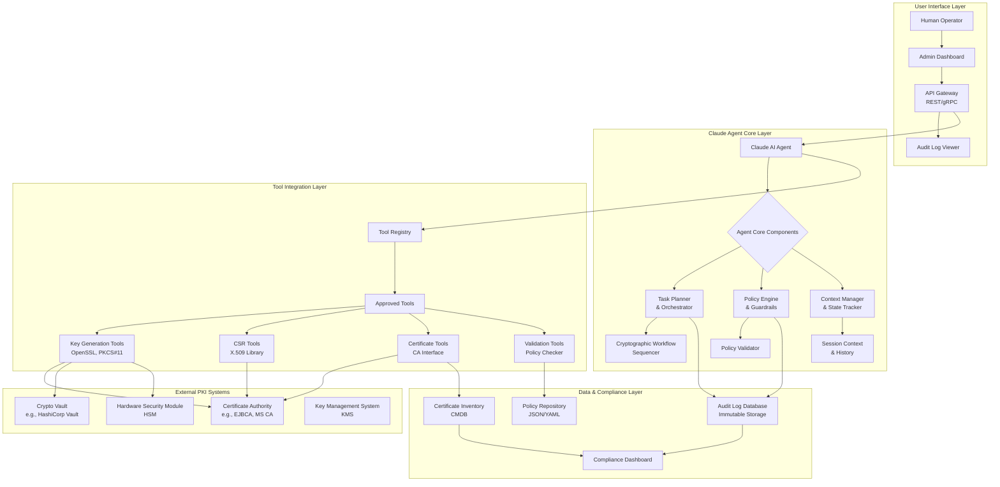

# 📚 Documentation Index

| Document | Description | Key Sections |
|----------|-------------|--------------|
| **[Final-Decision.md](Final-Decision.md)** | Architecture selection guide | Decision matrices, Recommendations |
| **[Multi-Agent-Architecture.md](Multi-Agent-Architecture.md)** | Core multi-agent design | Agent roles, Communication protocol |
| **[Unified-System.md](Unified-System.md)** | Complete integrated system | Component integration, Workflows |
| **[MCP.md](MCP.md)** | Tool protocol integration | MCP server, Tool discovery |
| **[LangChain.md](LangChain.md)** | Agent framework | Agent orchestration, Memory management |
| **[GraphRAG.md](GraphRAG.md)** | Knowledge system | Knowledge graph, Semantic search |
| **[Implementation.md](Implementation.md)** | Practical implementation | Code examples, Policy enforcement |
| **[Deployment.md](Deployment.md)** | Operations guide | Setup, Kubernetes, Scaling |
| **[Monitoring.md](Monitoring.md)** | Observability | Audit logging, Alerting |
| **[POC.md](POC.md)** | Proof of concept | Demos, Quick start |
| **[Plugin.md](Plugin.md)** | Plugin system | Extensibility, Templates |


# 1. Architecture Design
# System Architecture Diagram

```
┌─────────────────────────────────────────────────────────────┐
│                    User Interface Layer                      │
│  (CLI / Web UI / API Gateway)                               │
└───────────────────────┬─────────────────────────────────────┘
                        │ HTTP/JSON
                        ▼
┌─────────────────────────────────────────────────────────────┐
│                  Claude Agent Orchestrator                   │
│  ┌─────────────────────────────────────────────────────┐    │
│  │  Task Planner & Reasoner                            │    │
│  │  • Parse natural language requests                   │    │
│  │  • Sequence cryptographic operations                 │    │
│  │  • Validate against policies                         │    │
│  └─────────────────────────────────────────────────────┘    │
│                    │                                         │
│  ┌─────────────────────────────────────────────────────┐    │
│  │  Policy Engine Interface                            │    │
│  │  • Check key size requirements                      │    │
│  │  • Validate certificate parameters                  │    │
│  │  • Enforce compliance rules                         │    │
│  └─────────────────────────────────────────────────────┘    │
│                    │                                         │
│  ┌─────────────────────────────────────────────────────┐    │
│  │  Tool Dispatcher                                   │    │
│  │  • Route to appropriate tool                       │    │
│  │  • Handle error conditions                         │    │
│  │  • Validate outputs                                │    │
│  └─────────────────────────────────────────────────────┘    │
└───────────────────────┬─────────────────────────────────────┘
                        │ Tool Calls
                        ▼
┌─────────────────────────────────────────────────────────────┐
│                    Tool Layer (External Systems)            │
│  ┌──────────┐  ┌──────────┐  ┌──────────┐  ┌──────────┐   │
│  │ OpenSSL  │  │  Vault   │  │  CA API  │  │  HSM     │   │
│  │ CLI/API  │  │ (TLS/API)│  │ (REST)   │  │ (PKCS#11)│   │
│  └──────────┘  └──────────┘  └──────────┘  └──────────┘   │
└───────────────────────┬─────────────────────────────────────┘
                        │
                        ▼
┌─────────────────────────────────────────────────────────────┐
│                    Data Layer                               │
│  ┌─────────────────────────────────────────────────────┐    │
│  │  Certificate Inventory DB                           │    │
│  │  • PostgreSQL with crypto schema                    │    │
│  │  • All keys/certs metadata                          │    │
│  └─────────────────────────────────────────────────────┘    │
│  ┌─────────────────────────────────────────────────────┐    │
│  │  Audit Log (Immutable)                             │    │
│  │  • Tamper-evident storage                          │    │
│  │  • SIEM integration                                │    │
│  └─────────────────────────────────────────────────────┘    │
│  ┌─────────────────────────────────────────────────────┐    │
│  │  Policy Configuration                              │    │
│  │  • YAML/JSON configs                              │    │
│  │  • GitOps for versioning                          │    │
│  └─────────────────────────────────────────────────────┘    │
└─────────────────────────────────────────────────────────────┘
```




# Core Components
# 1. Claude Agent
Purpose: Main orchestrator and decision-maker

# Capabilities:

Natural language processing for requests

Multi-step planning and reasoning

Policy validation before execution

Error handling and recovery

# 2. Policy Engine
Policy Store: Git repository with YAML policy files

Validation Rules: Key size, algorithm, validity period, EKUs

Compliance Checks: NIST, FIPS, organizational standards

# 3. Tool Integrations
OpenSSL Wrapper: Safe command generation and output parsing

Vault Integration: Secure key storage and management

CA APIs: Integration with CAs (Let's Encrypt, Private CA)

HSM Interface: PKCS#11 for hardware security modules

# 4. Inventory & Audit
PostgreSQL Database: Structured storage of all crypto assets

Immutable Audit Log: Blockchain-like ledger or WORM storage

SIEM Integration: Real-time security monitoring


