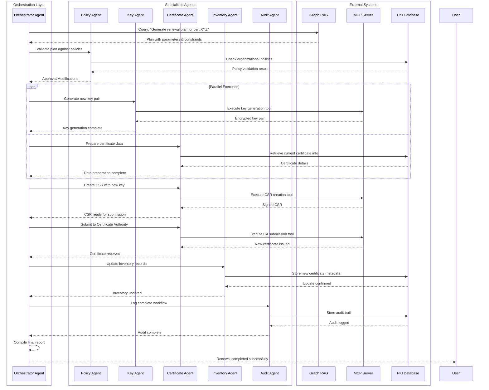
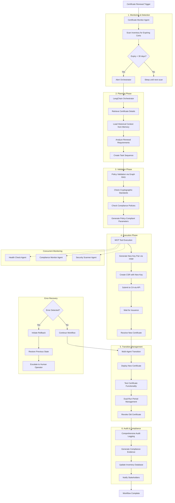

# 5. Complete Multi-Agent System with All Frameworks

#  Inter-Agent Communication Pattern

# Security & Policy Enforcement Flow

```mermaid
graph TD
    Request[Incoming Request] --> Parser
    
    subgraph "Input Validation Layer"
        Parser[Request Parser]
        Parser --> Sanitize[Input Sanitization]
        Sanitize --> ValidateFormat[Validate Request Format]
        ValidateFormat --> Extract[Extract Cryptographic Parameters]
    end
    
    Extract --> Guardrails
    
    subgraph "Safety Guardrails"
        Guardrails[Guardrail Engine]
        Guardrails --> Blocklist[Check Operation Blocklist]
        Blocklist --> ParamLimits[Check Parameter Limits]
        ParamLimits --> RateLimit[Apply Rate Limiting]
    end
    
    RateLimit --> PolicyCheck
    
    subgraph "Policy Enforcement"
        PolicyCheck[Policy Engine]
        PolicyCheck --> LoadPolicies[Load Relevant Policies]
        LoadPolicies --> GraphQuery[Query Knowledge Graph]
        GraphQuery --> ComplianceCheck[Check Compliance Rules]
        ComplianceCheck --> GenerateDecision[Generate Policy Decision]
    end
    
    GenerateDecision --> Decision{Policy Decision}
    
    Decision -->|Approved| Execute
    Decision -->|Rejected| Reject
    
    subgraph "Approved Execution"
        Execute[MCP Tool Execution]
        Execute --> SecureContext[Establish Secure Context]
        SecureContext --> ToolValidation[Validate Tool Integrity]
        ToolValidation --> ExecuteOperation[Execute Cryptographic Operation]
        ExecuteOperation --> ValidateResult[Validate Operation Result]
    end
    
    ValidateResult --> Audit
    
    subgraph "Audit & Compliance"
        Audit[Audit Logger]
        Audit --> LogOperation[Log Operation Details]
        LogOperation --> GenerateEvidence[Generate Compliance Evidence]
        GenerateEvidence --> StoreTamperProof[Store in Tamper-Evident Log]
    end
    
    StoreTamperProof --> Response[Return Response to User]
    
    Reject --> ErrorHandling
    subgraph "Error & Rejection Handling"
        ErrorHandling[Error Handler]
        ErrorHandling --> LogRejection[Log Policy Violation]
        LogRejection --> NotifySecurity[Notify Security Team]
        NotifySecurity --> ReturnError[Return Detailed Error]
    end
    
    ReturnError --> End[End Process]
    
    style Guardrails fill:#ffebee
    style PolicyCheck fill:#e8f5e8
    style Execute fill:#e3f2fd
    style Audit fill:#fff3e0
```

# Complete End-to-End Workflow: Certificate Renewal

# Advantages of This Architecture
# 6.1 Multi-Agent Advantages

Specialization: Each agent excels at specific tasks

Parallel Processing: Multiple agents work simultaneously

Fault Isolation: Agent failures don't crash entire system

Scalability: Add more agents as needed

Expert Knowledge: Domain-specific expertise per agent

# 6.2 MCP Advantages

Tool Standardization: Consistent interface across all tools

Runtime Discovery: Agents discover new capabilities dynamically

Safety & Validation: Built-in validation for all tool calls

Interoperability: Works with any MCP-compliant system

Debugging: Clear, standardized tool call logs

# 6.3 LangChain Advantages

Agent Framework: Proven framework for agent development

Memory Management: Built-in conversation memory

Tool Integration: Easy integration with external tools

Prompt Management: Structured prompt templates

Chain-of-Thought: Built-in reasoning capabilities

# 6.4 Graph RAG Advantages

Structured Knowledge: Entities and relationships

Multi-hop Reasoning: Traverse relationships for answers

Dynamic Updates: Easy to add new knowledge

Contextual Answers: Answers based on entity relationships

Explainability: Trace reasoning through graph

# 6.5 Combined Benefits

Resilience: Multiple frameworks provide redundancy

Flexibility: Mix and match components as needed

Extensibility: Easy to add new capabilities

Maintainability: Clear separation of concerns

Performance: Parallel processing across components

